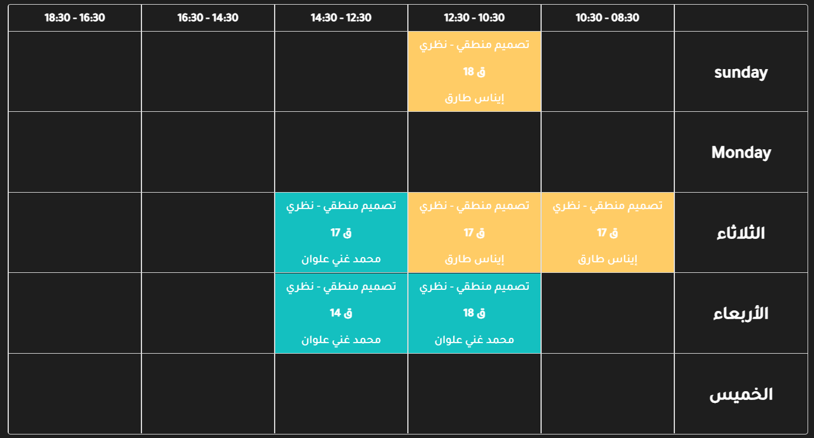
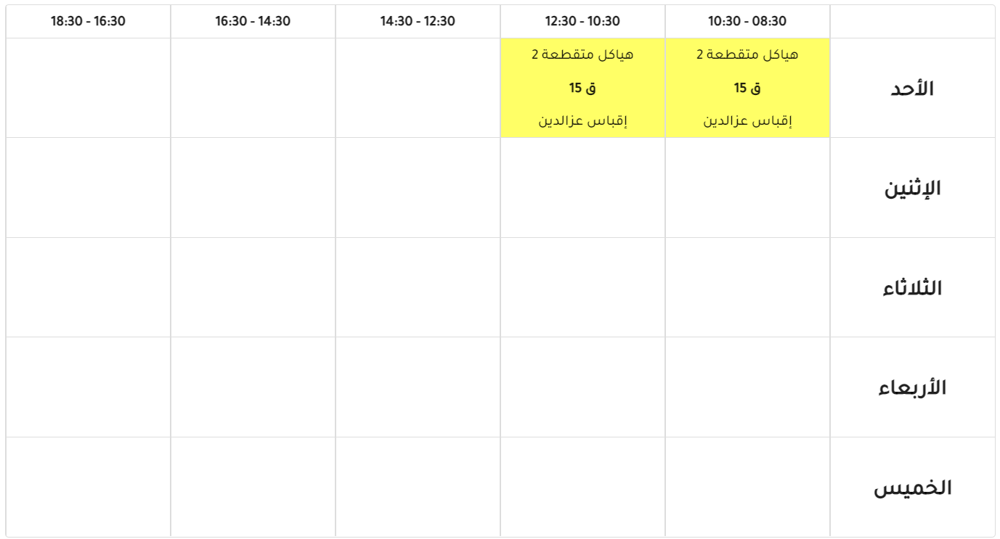

# Vue and nuxt pure and simple timetable

## Perfect structure for timetable with ts types

## TODO

- [x] bidirectional
- [x] i18n by item
- [x] dark theme support

### Github

### [https://github.com/masreplay/pure-timetable](https://github.com/masreplay/pure-timetable)

### npm

### [https://www.npmjs.com/package/pure-timetable](https://www.npmjs.com/package/pure-timetable)

### USE

[type: ScheduleDetails](https://github.com/masreplay/pure-timetable/blob/master/src/types/ScheduleDetails.ts)

```ts
<template>
    <Timetable schedule="timetable">
</template>

<script lang="ts or js">
import Timetable from "pure-timetable";

const timetable: ScheduleDetails = {}; // https://github.com/masreplay/pure-timetable/blob/master/src/types/ScheduleDetails.ts

</script>
```

## images

**DARK**


**LIGHT**

